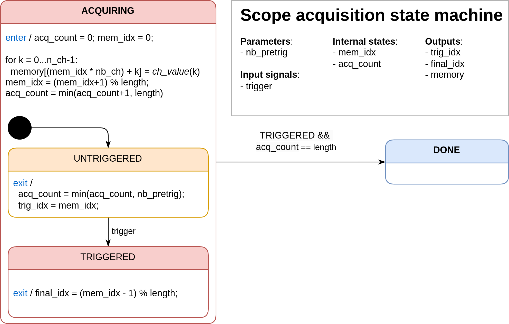

# Python mockup of ScopeMimicry

Pierre Haessig, March 2025

This small repo contains in the [Scopemimicry_Python.ipynb](Scopemimicry_Python.ipynb) Jupyter notebook a Python mockup of the C++ library [scopemimicry](https://github.com/owntech-foundation/scopemimicry) by OwnTech (which serves to record time series of variables within a microcontroller program)

## Scope data acquisition

The first goal of this interactive mockup is to investigate potential issues like recording with a delay.

The notebook also implements a redesigned "v2" acquisition state machine:



## Scope data dump

A second goal of this mockup is to investigate glitches in the scope data dump. 

Symptom: in the record. E.g. in the `YYYY-mm-DD_HH-MM-SS-record.txt` file, the final value gets repeated:

```
29.895383834838867
-0.14423918724060059
312.7880859375
312.7880859375
```

From this mockup, the data dump logic seems fine (no observed repetition), so that the issue probably happens later, perhaps:

- serial link transmission issue ? or 
- in the custom [Pio Device Monitor Filter](https://docs.platformio.org/en/latest/core/userguide/device/cmd_monitor.html#cmd-device-monitor-filters): [filter_recorded_datas.py](https://github.com/owntech-foundation/Core/blob/main/owntech/scripts/monitor/filter_recorded_datas.py) ? *TO BE INVESTIGATED*
